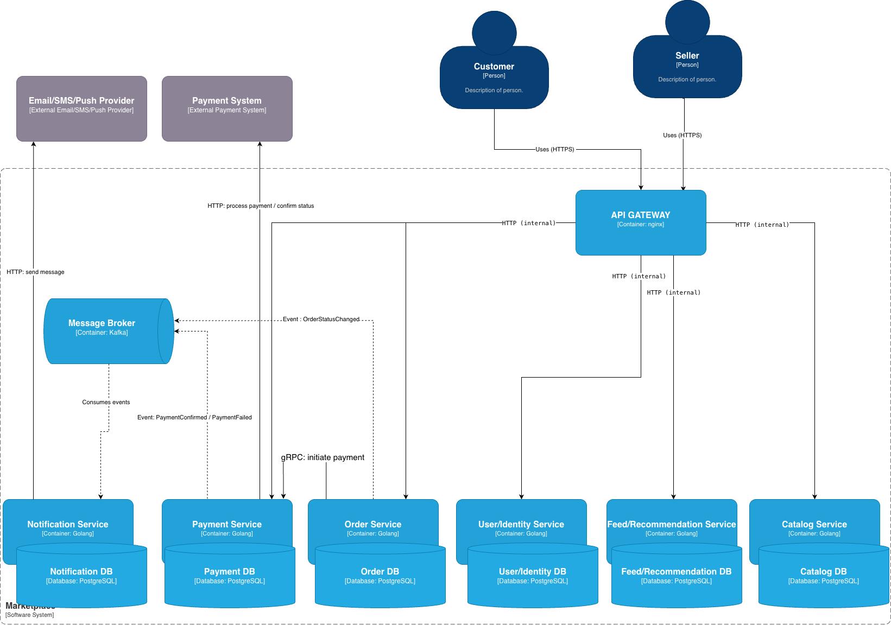

# Архитектурное проектирование маркетплейса (C4 + инициализация сервиса)

Учебный проект для ДЗ по архитектуре маркетплейса.
На этом этапе бизнес-функциональность не реализуется: в коде поднят только технический каркас одного сервиса с endpoint `GET /health`.

## Быстрая проверка

```bash
docker compose up --build -d
curl -i http://localhost:8000/health
go test ./...
docker compose down
```

Ожидаемый результат:

- `curl` возвращает `HTTP/1.1 200 OK`;
- `go test ./...` проходит без ошибок.

## 1. Соответствие критериям оценивания

| Критерий | Где закрыт |
|---|---|
| 1. Базовая C4 Container-диаграмма | Раздел 2, файл `docs/c4-container.png` |
| 2. Сервис поднимается в Docker и отвечает `200 OK` | Разделы 8 и 9, файлы `Dockerfile`, `docker-compose.yml`, `cmd/useridentity/main.go` |
| 3. Выделены домены и их ответственность | Раздел 3 |
| 4. Объяснено распределение доменов по сервисам | Раздел 4 |
| 5. Определены границы владения данными и взаимодействия | Разделы 5 и 6 |
| 6. Описаны альтернативные варианты декомпозиции | Раздел 7 |
| 7. Зафиксированы trade-off вариантов | Раздел 7 |
| 8. Обоснован финальный выбор | Раздел 7 (подраздел «Выбранный вариант») |

## 2. C4 Container

Диаграмма контейнеров: `docs/c4-container.png`.



### Акторы

- `Покупатель`
- `Продавец`

### Внешние системы

- `External Payment System`
- `Notification Provider (Email/SMS/Push)`

### Контейнеры маркетплейса

| Контейнер | Назначение | Тип взаимодействий |
|---|---|---|
| `API Gateway` | Единая точка входа для клиентов, маршрутизация запросов | Синхронные |
| `User Identity Service` | Пользователи, роли, идентификация | Синхронные |
| `Catalog Service` | Управление товарным каталогом продавцов | Синхронные |
| `Feed Service` | Персонализированная выдача ленты товаров | Синхронные + асинхронные |
| `Order Service` | Создание заказа и смена статусов | Синхронные + асинхронные |
| `Payment Service` | Инициация и учет платежей | Синхронные + асинхронные |
| `Notification Service` | Отправка уведомлений о статусах | Асинхронные + внешние синхронные |
| `Message Broker` | Транспорт доменных событий | Асинхронные |

### Хранилища данных

Shared DB отсутствует. Каждый сервис владеет собственной БД:

- `user_db`
- `catalog_db`
- `feed_db`
- `order_db`
- `payment_db`
- `notification_db`

## 3. Домены и зоны ответственности

| Домен | Ответственность |
|---|---|
| `Пользователи` | Профили, роли, идентификация, сессии |
| `Каталог` | Карточки товаров, атрибуты, цены, остатки |
| `Лента` | Персонализированная выдача и ранжирование |
| `Заказы` | Создание заказа, статусы, жизненный цикл |
| `Платежи` | Инициация оплаты, фиксация результатов |
| `Уведомления` | Отправка сообщений о статусах заказа/платежа |

### Персонализация ленты (архитектурный вариант)

`Feed Service` использует гибридную концепцию:

- rule-based фильтрация и базовая релевантность;
- пользовательские сигналы (просмотры, покупки, предпочтения);
- fallback для cold start (популярные товары по категории/сегменту).

Это архитектурное решение, без реализации бизнес-логики в коде на данном этапе.

## 4. Распределение доменов по сервисам

| Сервис | Домен(ы) | Логика выделения |
|---|---|---|
| `User Identity Service` | Пользователи | Безопасность и управление доступом |
| `Catalog Service` | Каталог | Частые изменения данных от продавцов |
| `Feed Service` | Лента | Отдельное масштабирование read-heavy нагрузки |
| `Order Service` | Заказы | Оркестрация жизненного цикла заказа |
| `Payment Service` | Платежи | Изоляция внешней платежной интеграции |
| `Notification Service` | Уведомления | Асинхронная доставка и ретраи |

Принцип разбиения: `один домен = один сервис` для прозрачных границ и независимого масштабирования.

## 5. Границы владения данными

| Сервис | Владеет данными | Не владеет | Граница ответственности |
|---|---|---|---|
| `User Identity Service` | `users`, `roles`, `credentials`, `sessions` | Заказы, товары, платежи | Идентификация и доступ |
| `Catalog Service` | `products`, `prices`, `stock`, `categories` | Пользователи, заказы, платежи | Актуальность каталога |
| `Feed Service` | `ranking_features`, `recommendation_cache` | Заказы, платежные записи | Персонализированная выдача |
| `Order Service` | `orders`, `order_items`, `order_status_history` | Авторизация, транзакции PSP | Жизненный цикл заказа |
| `Payment Service` | `payments`, `payment_attempts`, `payment_status_history` | Состав заказа, каталог | Учет платежных транзакций |
| `Notification Service` | `notification_templates`, `delivery_log`, `delivery_status` | Заказы как источник истины | Доставка уведомлений |

## 6. Взаимодействия сервисов

### Синхронные

| Откуда | Куда | Способ |
|---|---|---|
| `Buyer/Seller Client` | `API Gateway` | HTTPS REST |
| `API Gateway` | `User Identity / Catalog / Feed / Order` | HTTP/gRPC |
| `Order Service` | `Payment Service` | HTTP/gRPC (инициация платежа) |
| `Payment Service` | `External Payment System` | HTTPS API |
| `Notification Service` | `Notification Provider` | HTTPS API |

### Асинхронные (через `Message Broker`)

| Producer | Event | Consumer |
|---|---|---|
| `Order Service` | `OrderCreated`, `OrderStatusChanged` | `Notification Service`, `Feed Service` |
| `Payment Service` | `PaymentSucceeded`, `PaymentFailed` | `Order Service`, `Notification Service` |
| `Catalog Service` | `ProductUpdated` | `Feed Service` |

## 7. Альтернативы декомпозиции и trade-off

### Вариант A: доменные микросервисы (выбран)

Состав: `API Gateway` + отдельный сервис на каждый домен + `Message Broker`.

Плюсы:

- независимое масштабирование и релизы;
- четкие доменные границы и владение данными;
- нативная поддержка событийных сценариев.

Минусы:

- выше операционная сложность (наблюдаемость, CI/CD, контракты);
- сложнее распределенная отладка;
- больше межсервисных интеграций.

Trade-off: сложнее эксплуатация, но выше гибкость при росте нагрузки и команды.

### Вариант B: модульный монолит + внешние адаптеры

Состав: один backend с модулями (`User`, `Catalog`, `Feed`, `Order`) и отдельными адаптерами для платежей/уведомлений.

Плюсы:

- быстрее старт разработки;
- проще локальная отладка;
- ниже инфраструктурные затраты в начале.

Минусы:

- сложнее независимое масштабирование;
- общий релизный цикл;
- выше риск размывания модульных границ.

Trade-off: быстрее старт, но хуже эволюция при росте.

### Вариант C: макросервисы по бизнес-потокам + event-stream

Состав:

- `Identity Service` (пользователи и доступ);
- `Merchant Service` (каталог продавцов);
- `Commerce Core Service` (заказы + платежный workflow);
- `Engagement Service` (лента + уведомления);
- `Event Stream` + read-модели под выдачу и аналитику.

Плюсы:

- меньше сервисов, чем в варианте A, при сохранении разделения по ключевым потокам;
- изоляция критичного транзакционного контура (`Commerce Core`);
- удобно масштабировать read-сценарии через отдельные проекции.

Минусы:

- сложнее схема событий и поддержка совместимости контрактов;
- выше нагрузка на согласованность read-моделей (eventual consistency);
- часть доменов объединяется в крупные сервисы, что снижает чистоту доменных границ.

Trade-off: компромисс между простотой варианта B и гибкостью варианта A, но с ценой в сложность событийной платформы.

### Выбранный вариант и обоснование

Выбран `Вариант A`, потому что он лучше соответствует ограничениям и критериям задания:

- явно фиксирует домены и зоны ответственности;
- исключает shared DB;
- прозрачно показывает синхронные и асинхронные интеграции;
- покрывает кейс персонализации, заказов, платежей и уведомлений.

Почему не `Вариант B`:

- слабее демонстрирует границы сервисов для C4 Container на уровне отдельных доменов;
- хуже масштабируется независимо по разным типам нагрузки.

Почему не `Вариант C`:

- для учебного объема избыточна сложность event-stream и поддержки проекций;
- хуже прозрачность владения доменами из-за укрупненных сервисов.

Подробная аргументация: `docs/architecture-decisions.md`.

## 8. Реализованный сервис (инициализация)

В коде реализован только `User Identity Service` как технический каркас без бизнес-логики:

- код: `cmd/useridentity/main.go`;
- тесты: `cmd/useridentity/main_test.go`;
- endpoint: `GET /health`;
- ответ: `200 OK` и JSON.

Остальные сервисы из C4 и ADR описаны архитектурно и не реализованы кодом на этом этапе (в соответствии с условиями ДЗ).

## 9. Запуск проекта

### Тесты

```bash
go test ./...
```

### Локальный запуск

```bash
PORT=18080 go run ./cmd/useridentity
```

Проверка:

```bash
curl -i http://localhost:18080/health
```

Ожидаемо:

- статус `HTTP/1.1 200 OK`;
- JSON с полями `status`, `service`, `timestamp`.

### Запуск в Docker

```bash
docker compose up --build -d
```

Проверка:

```bash
curl -i http://localhost:8000/health
```

Ожидаемо:

- статус `HTTP/1.1 200 OK`;
- пример тела ответа:

```json
{"status":"ok","service":"user-identity-service","timestamp":"2026-02-22T19:38:55Z"}
```

Остановка:

```bash
docker compose down
```

## 10. Состав репозитория

- `README.md` — описание архитектуры и решений;
- `docs/c4-container.png` — C4 Container-диаграмма;
- `docs/architecture-decisions.md` — ADR по ключевым решениям;
- `cmd/useridentity/main.go` — исходный код сервиса;
- `cmd/useridentity/main_test.go` — тесты health-check;
- `Dockerfile`, `docker-compose.yml` — контейнеризация и запуск.
